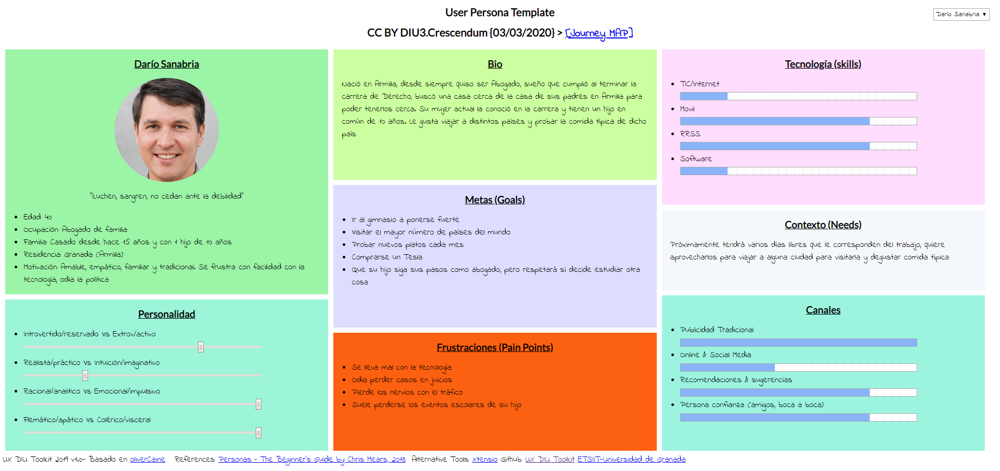
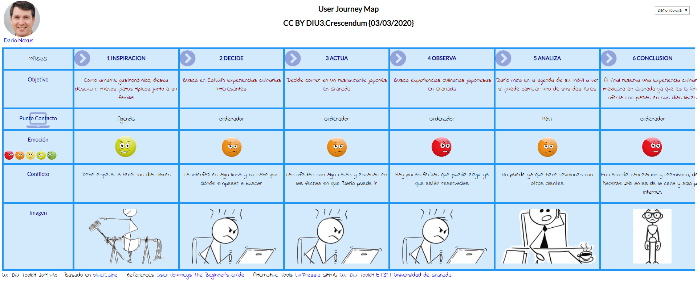

# Análisis competitivo:

Las aplicaciones de compartir ocio permiten al usuario vivir nuevas experiencias con otros usuarios con los mismos gustos. Se han seleccionado varias aplicaciones, de entre ellas facebook, meetup, emycet, artery, eatwith,... Finalmente se ha seleccionado eatwith por varios motivos:
    No es tan conocido como otras aplicaciones como Facebook o Meetup.
    Ni es muy general ni muy específico, se centra en experiencias sobre la comida, pero no se centra únicamente en comer, también tiene experiencias cocinando.
    A simple vista se han detectado posibles mejoras en el diseño de la página.
   
La aplicación eatwith proporciona experiencias culinarias, de entre ellas comidas privadas, tours y clases de cocina.

# Análisis personal:

## Darío
Se ha escogido a Darío debido a tener el perfil de un usuario maduro pero torpe con la tecnología. Le gusta viajar, desde siempre lo hizo a través de agencias de viajes pero hace poco descubrió que por Internet le puede salir más barato, el problema es su poca experiencia con los ordenadores.

## Anabel
Se ha escogido a Anabel porque representa el perfil de un usuario joven y hábil con la tecnología, al contrario que ocurre con Darío, un usuario que se frustra muy fácilmente con la tecnologa. También se ha escogido debido a su comportamiento mas excéntrico y alocado.

# Journey Map:
Se ha escogido un caso esporádico en el caso de Darío el cual tiene problemas al manejar un ordenador y un caso programado  por parte de Anabel la cual tiene experiencia para poder analizar en ambos casos la experiencia del usuario.

## Darío

## Anabel

# Usability review

# UX DIU Toolkit

Herramientas en HTML5 para creación de: 
    - 2 Personas 
    - 2 User Journey Map 

Recursos en: https://github.com/mgea/UX-DIU-Toolkit

V.1.0 Feb,12 2020

Se deben crear *dos personas ficticias*. (http://www.uxforthemasses.com/personas/) que puedan ser usuarios interesados en las actividades que se ofertan en esa ciudad. Información acerca de cómo construir Personas Ficticias: http://www.ux-lady.com/diy-user-personas/. Hay herramientas (fremium) para crear Personas ficticias: https://xtensio.com/how-to-create-a-persona/. Con https://randomuser.me podemos  obtener imágenes/features de personas aleatorias.

Incluir *dos mapas de experiencia del usuario* (User Journey Experience Map) uno para cada usuario donde se describa la interacción de un usuarios con el interfaz para realizar una tarea.  Más información de cómo abordar una mapa de experiencia de usuario: http://theuxreview.co.uk/user-journeys-beginners-guide/. Se puede usar la herramienta online: https://uxpressia.com/ o bien la plantilla http://www.burokoos.com/assets/uploads/2012/04/koos_customer_journey_mapping.pdf 
https://uxpressia.com/templates/cjm-for-website-visitor 

ce

Tareas: 

 - Incluir información en ficheros personas.js / Journey.js
 - Preparado para 2 plantillas
 - Se debe añadir información del equipo

ToDo: 
 - Configurar al movil
 - E/S con JSON
