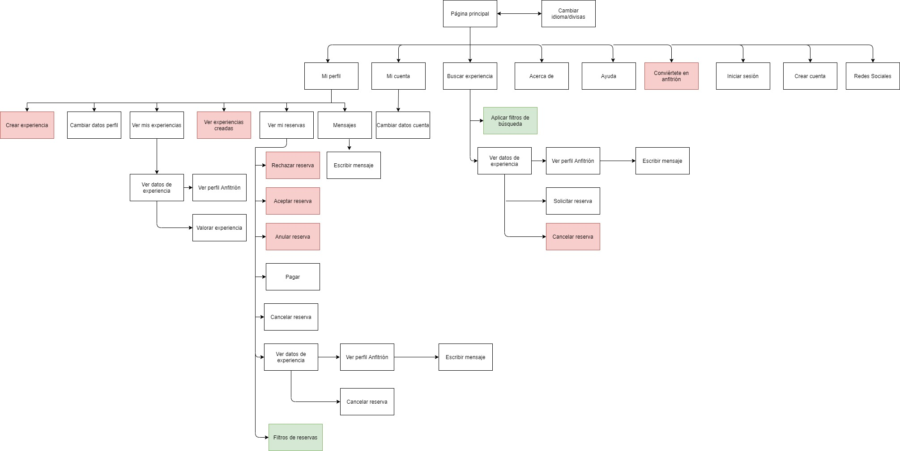

DIU - Practica2, entregables

**1. Malla receptora de información **

| Interesante/Relevante  | Críticas constructivas  | Preguntas a partir de la experiencia | Nuevas ideas |
| :---        |  :----:   | :----: | :----: |
| Permite ganar un dinero extra con tu hobbie.    | El vídeo de la página principal satura demasiado, sería recomendable cambiarlo por ejemplo por una imágen estática.  |   Anabel - ¿ Es posible realizar búsquedas solo a partir de un único filtro?   |  Comunicación - Añadir servicios en los idiomas en los que se muestra la información principal. El sistema de soporte y compartir en redes sociales no se encuentra en todos los idiomas.        |              
| Información abundante, útil y fiable      | El idioma del soporte solo está disponible en inglés, para un buen uso es necesario traducirlo al resto de idiomas que ofrece.  |  Darío - ¿ Hay aplicación android ? No veo nada en la página web. | Interacción - Reubicar elementos para evitar el uso de scroll.   |              
| Gran variedad de experiencias únicas.      | En general existen muchos elementos en cada página que pueden agobiar al usuario, sobre todo a la hora de necesitar hacer scroll, esto hace que no sea accesible.  |  Darío - ¿ Cómo puedo saber si la comida contiene gluten ? Mi mujer es celíaca.     |  UX Engagement - Una mejora en la latencia del sitio web. |              
| Aplicación para móviles disponible.        | Ciertos elementos no tienen un indicador claro de ser un enlace, por ejemplo el icono a la página principal.  | Anabel - ¿ Puedo compartir mi experiencia en Instagram ? No uso las redes sociales que deja la aplicación.  |  UX Engagement - Conseguir una mayor retención y uso agradable por parte de los usuarios.  |              

**2. User/Task flow**

| Tareas\Grupo de usuarios | **`Usuarios consumidores`** | **`Usuarios anfitriones`** | Profesional |
| :---                     | :----:  | :----:  | :----:  | 
| **`Ver datos de experiencia`** |   H   |    M    |    M    |   
| **`Ver mis experiencias`**     |   M   |    M    |    M    |    
| **`Ver mi perfil`**            |   M   |    M    |    M    |    
| **`Iniciar sesión`**           |   M   |    M    |    M    |   
| **`Ver mis reservas`**         |   M   |    M    |    M    |    
| Crear experiencia nueva  |       |    M    |    H    |    
| Responder mensaje        |   L   |    M    |    M    |   
| Ver mi cuenta            |   M   |    M    |    L    |   
| Ver mensajes             |   L   |    M    |    M    |   
| Aplicar filtros de búsqueda    |   H   |    L   |    L    |    
| Cambiar datos perfil     |   L   |    M    |    M    |   
| Buscar experiencia       |   H   |    L    |         |   
| Pagar                    |   H   |    L    |         |    
| Seleccionar experiencia  |   M   |    L    |        |   
| Rechazar reserva         |       |    L    |    M    |    
| Ver perfil de Host       |   M   |    L    |         |   
| Solicitar reserva        |   M   |    L    |         |    
| Crear cuenta             |   L   |    L    |    L    |  
| Cambiar idioma/divisas   |   L   |    L    |    L    |   
| Convertirse en anfitrión |       |    L    |    L    |   
| Cancelar reserva         |   L   |    L    |         |    
| Valorar experiencia      |   L   |    L    |         | 
| Anular reserva           |       |    L    |    L    |   

**3. Arquitectura de la información**
Sitemap

Labelling

| **Label**  |  **Scope Note**   |    
| Página principal        |   Página de inicio del sitio web, contiene los elemento comunes a las demás páginas (header, footer)   |   
| Cambiar idioma/divisas            |   Botón que permite cambiar el idioma de la página y la divisa a la hora de calcular precios   |
| Mi perfil | | 
| Mi cuenta | |  
| Buscar experiencia | |  
| Acerca de | |  
| Ayuda | |  
| Conviértete en anfitrión| |  
| Iniciar sesión | |
| Crear cuenta | |  
| Crear experiencia  | |  
| Cambiar datos perfil  | |  
| Ver mis experiencias | |  
| Ver experiencias propuestas | |  
| Ver mis reservas | |  ----------------
| Mensajes | |  
| Cambiar datos cuenta | |  
| Aplicar filtros de búsqueda | |  
| Ver datos de experiencia | |  
| Ver perfil anfitrión | | 
| Valorar experiencia | |  
| Rechazar reserva | |  
| Aceptar reserva | |  
| Anular reserva | |  
| Pagar | |  
| Cancelar reserva | |  
| Solicitar reserva | |  
| Escribir mensaje | |  
| | |  
| | |  
| | |  
| | |  
| | |  
| | |  

