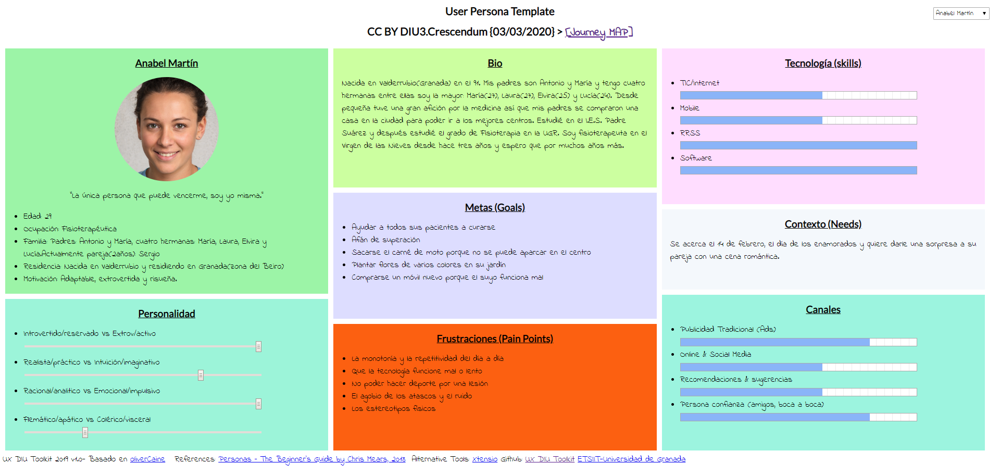
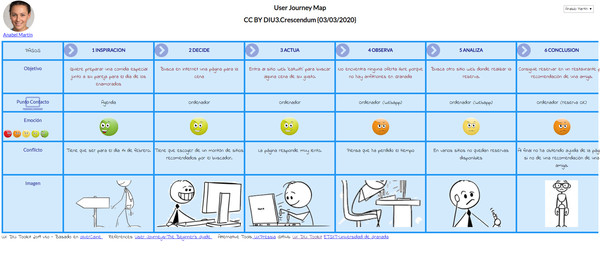

# DIU20
Prácticas Diseño Interfaces de Usuario 2019-20 (Economía Colaborativa) 

Grupo: DIU3.Crescendum.  Curso: 2019/20 

Proyecto: 

Descripción: 

Logotipo: 

Miembros
 * :bust_in_silhouette:   Javier Martín Gómez   :octocat:     
 * :bust_in_silhouette:  Pablo Martín González    :octocat:

----- 

En esta práctica estudiaremos un caso de plataforma de economía colaborativa y realizaremos una propuesta para su diseño Web/movil. Utilizaremos herramientas y entregables descritos en el siguiente CheckList (https://github.com/mgea/UX-DIU-Checklist) 

Qué es economia colaborativa: Martínez-Polo, J. (2019). **El fenómeno del consumo colaborativo: del intercambio de bienes y servicios a la economía de las plataformas**, *Sphera Publica, 1*(19), 24-46. http://sphera.ucam.edu/index.php/sphera-01/article/view/363/14141434

>>> Este documento es el esqueleto del report final de la práctica. Aparte de subir cada entrega a PRADO, se debe actualizar y dar formato de informe final a este documento online. 

# Proceso de Diseño 

## Paso 1. UX Desk Research & Analisis 

 1.a Competitive Analysis
-----

Las aplicaciones de compartir ocio permiten al usuario vivir nuevas experiencias con otros usuarios con los mismos gustos, en nuestro caso hemos elegido la aplicación "eatwith" en la que puedes tener una experiencia culinaria, ya sea tours de comida, clases de cocina o alguna experiencia gastronómica.

 1.b Persona
-----

Hemos elegido a Darío y Anabel ya que son personas corrientes y son el tipo de usuario novatos que pueden tener problemas al navegar en las aplicaciones.
## [Darío](https://pmartin97.github.io/indexP.html)

## [Anabel](https://pmartin97.github.io/indexP.html)

 1.c User Journey Map
----

Se ha escogido un caso esporádico y otro programado para poder analizar en ambos casos la experiencia del usuario.

## [Darío](https://pmartin97.github.io/indexJ.html)

## [Anabel](https://pmartin97.github.io/indexJ.html)

 1.d Usability Review
----
La aplicación en cuanto a funcionalidad es correcta. El registro, las búsquedas y otras funciones son sencillas y fáciles de entender. En cuanto al aspecto visual, la página contiene demasiado contenido concentrado y en muchas ocasiones incluso innecesario. Otros aspectos extras como el cambio de idioma y moneda puede ser de de utilidad, el problema es que en la sección de ayuda no está traducido.

Los aspectos más graves son:
1. Vídeo en bucle en la página principal, es demasiado grande y provoca latencia, distracción y malestar.
2. Sección de ayuda no está traducido
3. Las búsquedas tienen pocos filtros y es todo muy genérico a la hora de buscar.

## Paso 2. UX Design  

 2.a Feedback Capture Grid
----

| Interesante/Relevante  | Críticas constructivas  | Preguntas a partir de la experiencia | Nuevas ideas |
| :---        |  :----:   | :----: | :----: |
| Permite ganar un dinero extra con tu hobbie.    | El vídeo de la página principal satura demasiado, sería recomendable cambiarlo por ejemplo por una imágen estática.  |   Anabel - ¿ Es posible realizar búsquedas solo a partir de un único filtro?   |  Comunicación - Añadir servicios en los idiomas en los que se muestra la información principal. El sistema de soporte y compartir en redes sociales no se encuentra en todos los idiomas.        |              
| Información abundante, útil y fiable      | El idioma del soporte solo está disponible en inglés, para un buen uso es necesario traducirlo al resto de idiomas que ofrece.  |  Darío - ¿ Hay aplicación android ? No veo nada en la página web. | Interacción - Reubicar elementos para evitar el uso de scroll.   |              
| Gran variedad de experiencias únicas.      | En general existen muchos elementos en cada página que pueden agobiar al usuario, sobre todo a la hora de necesitar hacer scroll, esto hace que no sea accesible.  |  Darío - ¿ Cómo puedo saber si la comida contiene gluten ? Mi mujer es celíaca.     |  UX Engagement - Una mejora en la latencia del sitio web. |              
| Aplicación para móviles disponible.        | Ciertos elementos no tienen un indicador claro de ser un enlace, por ejemplo el icono a la página principal.  | Anabel - ¿ Puedo compartir mi experiencia en Instagram ? No uso las redes sociales que deja la aplicación.  |  UX Engagement - Conseguir una mayor retención y uso agradable por parte de los usuarios.  |  

 2.b Tasks & Sitemap 
-----

En la siguiente tabla mostramos las distintas funcionalidades del sitio además de los grupos que lo van a usar y la frecuencia de uso, marcando en negrita tanto los usuarios como funcionalidades más importantes.

| Tareas\Grupo de usuarios | **`Usuarios consumidores`** | **`Usuarios anfitriones`** | Profesional |
| :---                     | :----:  | :----:  | :----:  | 
| **`Ver datos de experiencia`** |   H   |    M    |    M    |   
| **`Ver mis experiencias`**     |   M   |    M    |    M    |    
| **`Ver mi perfil`**            |   M   |    M    |    M    |    
| **`Iniciar sesión`**           |   M   |    M    |    M    |   
| **`Ver mis reservas`**         |   M   |    M    |    M    |    
| Crear experiencia nueva  |       |    M    |    H    |    
| Responder mensaje        |   L   |    M    |    M    |   
| Ver mi cuenta            |   M   |    M    |    L    |   
| Ver mensajes             |   L   |    M    |    M    |   
| Aplicar filtros de búsqueda    |   H   |    L   |    L    |    
| Cambiar datos perfil     |   L   |    M    |    M    |   
| Buscar experiencia       |   H   |    L    |         |   
| Pagar                    |   H   |    L    |         |    
| Seleccionar experiencia  |   M   |    L    |        |   
| Rechazar reserva         |       |    L    |    M    |    
| Ver perfil de Host       |   M   |    L    |         |   
| Solicitar reserva        |   M   |    L    |         |    
| Crear cuenta             |   L   |    L    |    L    |  
| Cambiar idioma/divisas   |   L   |    L    |    L    |   
| Convertirse en anfitrión |       |    L    |    L    |   
| Cancelar reserva         |   L   |    L    |         |    
| Valorar experiencia      |   L   |    L    |         | 
| Anular reserva           |       |    L    |    L    |   

**Sitemap**

 2.c Labelling 
----

| **Label**  |  **Scope Note**   |   
| :----:  | :----: |
| Página principal        |   Página de inicio del sitio web, contiene los elemento comunes a las demás páginas (header, footer)   |   
| Cambiar idioma/divisas            |   Botón que permite cambiar el idioma de la página y la divisa a la hora de calcular precios   |
| Mi perfil | Botón que permite acceder a la información de tu perfil | 
| Mi cuenta | Botón que permite acceder a la información de tus credenciales de acceso |  
| Buscar experiencia | Este botón te permite hacer una búsqueda de una experiencia dados unos párametros |  
| Acerca de | Botón que muestra la información del sitio, aviso legal, términos y condiciones y política de privacidad |  
| Ayuda | Botón para poder contactar con el servicio de atención al cliente y poder resolver dudas |  
| **Conviértete en anfitrión** |  Acción condicional: solo se permite su uso a usuarios no anfitriones. Con este botón siendo usuario puedes convertirte en anfitrión y crear experiencias |  
| Iniciar sesión | Botón que permite iniciar sesión introduciendo nombre de usuario o email y contraseña, además si te has olvidado la contraseña habrá un botón estilo "¿has olvidado la contraseña?" |
| Crear cuenta | Botón para crear una cuenta nueva introduciendo una serie de datos de un formulario | 
| Redes sociales | Botones para acceder a las redes sociales del sitio como Facebook, Twitter, Instagram entre otros |  
| **Crear experiencia**  | Acción condicional: solo se permite su uso a usuarios anfitriones. Botón que permite crear una experiencia siendo anfitrión, dando una serie de datos de un formulario |  
| Cambiar datos perfil  | Sección que permite cambiar información de tu perfil |  
| Ver mis experiencias | Página que contiene todas las experiencias que has realizado  |  
| **Ver experiencias creadas** | Acción condicional: solo se permite su uso a usuarios anfitriones. Página que permite ver las experiencias creadas por un anfitrión|  
| Ver mis reservas | Página donde puedes ver las reservas de experiencias que tienes |
| Mensajes | Página que contiene los mensajes enviados y recibidos con otros usuarios de la plataforma |  
| Cambiar datos cuenta | Sección de página que permite modificar los cambios de cuenta del usuario con un formulario y un botón de guardado |  
| **Aplicar filtros de búsqueda** | Acción opcional: se permite su uso para obtener resultados más específicos. Conjuntos de filtros **opcionales** para realizar la búsqueda de una experiencia. De entre ellos destacamos: fecha, número de invitados, precio, reserva instantánea, tipo de evento, tipo de cocina, idioma del anfitrión, lugar y régimen alimenticio.  | 
| Filtros de reservas | Conjunto de filtros para encontrar reservas según si están pagados, confirmados, rechazados... |  
| Ver datos de experiencia | Página que muestra todos los datos relevantes de una experiencia como su nombre, fecha, anfitrión, descripción, un botón para realizar una reserva, etc.|  
| Ver perfil anfitrión | Página que muestra los datos públicos de un usuario anfitrión | 
| Valorar experiencia | Formulario que permite valorar la calidad de la experiencia culinaria realizada |  
| **Rechazar reserva** | Acción condicional: solo se permite su uso a usuarios anfitriones. Botón que permite rechazar la petición de reserva de un usuario que haya realizado una reserva en la experiencia organizada por el anfitrión   |  
| **Aceptar reserva** | Acción condicional: solo se permite su uso a usuarios anfitriones. Botón que permite aceptar la reserva de un usuario a un evento organizado por el anfitrión |  
| **Anular reserva** | Acción condicional: solo se permite su uso a usuarios anfitriones. Botón que permite anular una reserva en caso de que al anfitrión le haya surgido un problema que le impida organizar la experiencia |  
| Pagar | Formulario que permite la transacción del pago |  
| **Cancelar reserva** | Acción condicional: solo se permite su uso a usuarios que han solicitado reserva en una experiencia. Botón que permite cancelar la reserva de una experiencia si el usuario decide retractarse o no puede ir al evento |  
| Solicitar reserva | Botón que permite solicitar una reserva en una experiencia culinaria |  
| Escribir mensaje | Formulario que permite comunicar un mensaje a un usuario de la plataforma | 

 2.d Wireframes
-----

Bocetos realizados a partir de las funcionaldiades más importantes del Task Flow:

  1. Ver datos de experiencia.  
    
  
  
  
  2. Ver mis experiencias.  
     
  
  
  3. Ver mi perfil.   
      
  

  4. Iniciar sesión.  
     
  
  
  5. Ver mis reservas.  
   
  

## Paso 3. Make (Prototyping) 

 3.a Moodboard
-----

>>> Plantear Diseño visual con una guía de estilos visual (moodboard) 

  3.b Landing Page
----

>>> Plantear Landing Page 

 3.c Guidelines
----

>>> Estudio de Guidelines y Patrones IU a usar 

  3.d Mockup
----

>>> Layout: Mockup / prototipo HTML  (que permita simular tareas con estilo de IU seleccionado)

## Paso 4. UX Check (Usability Testing) 

 4.a A/B Testing
----

>>> Comprobacion de asignaciones para A/B Testing. Asignaciones https://github.com/mgea/DIU19/blob/master/ABtesting.md

>>>> Práctica A: 

 4.b User Testing
----

>>> Usuarios para evaluar prácticas 

| Usuarios | Sexo/Edad     | Ocupación   |  Exp.TIC    | Personalidad | Plataforma | TestA/B
| ------------- | -------- | ----------- | ----------- | -----------  | ---------- | ----
| User1's name  | H / 18   | Estudiante  | Media       | Introvertido | Web.       | A 
| User2's name  | H / 18   | Estudiante  | Media       | Timido       | Web        | A 
| User3's name  | M / 35   | Abogado     | Baja        | Emocional    | móvil      | B 
| User4's name  | H / 18   | Estudiante  | Media       | Racional     | Web        | B 

. 4.c Cuestionario SUS
----

>>> Usaremos el **Cuestionario SUS** para valorar la satisfacción de cada usuario con el diseño (A/B) realizado. Para ello usamos la [hoja de cálculo](https://github.com/mgea/DIU19/blob/master/Cuestionario%20SUS%20DIU.xlsx) para calcular resultados sigiendo las pautas para usar la escala SUS e interpretar los resultados
http://usabilitygeek.com/how-to-use-the-system-usability-scale-sus-to-evaluate-the-usability-of-your-website/)
Para más información, consultar aquí sobre la [metodología SUS](https://cui.unige.ch/isi/icle-wiki/_media/ipm:test-suschapt.pdf)

>>> Adjuntar captura de imagen con los resultados + Valoración personal 

 4.c Usability Report
----

>> Añadir report de usabilidad para práctica B 

## Paso 5. Evaluación de Accesibilidad  

  5.a Accesibility evaluation Report
----

>>> Indica qué pretendes evaluar (de accesibilidad) y qué resultados has obtenido + Valoración personal

>>> Evaluación de la Accesibilidad (con simuladores o verificación de WACG) 

## Conclusión / Valoración de las prácticas

>>> (90-150 caracteres) Opinión del proceso de desarrollo de diseño siguiendo metodología UX y valoración (positiva /negativa) de los resultados obtenidos  

