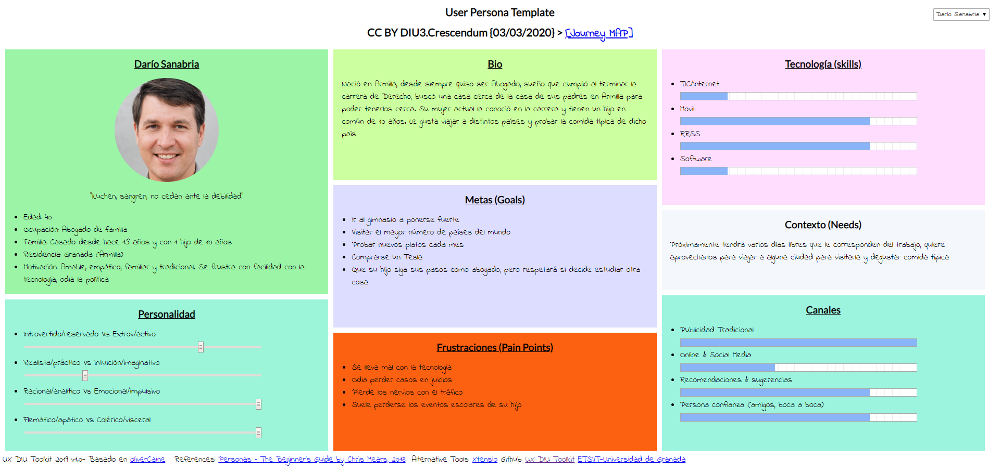
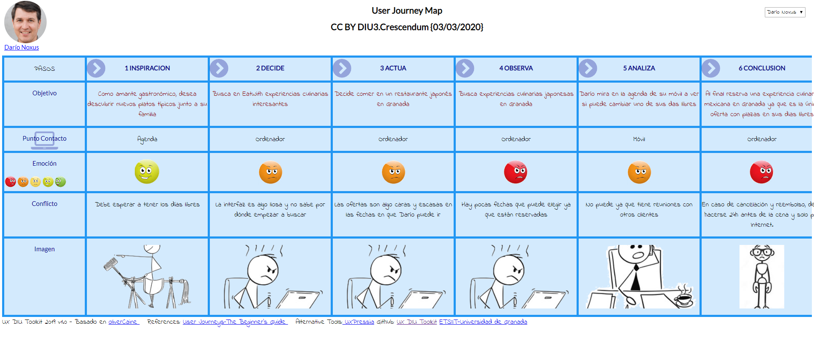

# DIU20
Prácticas Diseño Interfaces de Usuario 2019-20 (Economía Colaborativa) 

Grupo: DIU3.Crescendum.  Curso: 2019/20 

Proyecto: 

Descripción: 

Logotipo: 

Miembros
 * :bust_in_silhouette:   Javier Martín Gómez   :octocat:     
 * :bust_in_silhouette:  Pablo Martín González    :octocat:

----- 

# Proceso de Diseño 

## Paso 1. UX Desk Research & Analisis 

 1.a Competitive Analysis
-----

Las aplicaciones de compartir ocio permiten al usuario vivir nuevas experiencias con otros usuarios con los mismos gustos, en nuestro caso hemos elegido la aplicación "eatwith" en la que puedes tener una experiencia culinaria, ya sea tours de comida, clases de cocina o alguna experiencia gastronómica.
Para escoger nuestra aplicación se ha realizado un análisis competitivo y se ha seleccionado la opción más interesante para el estudio de diseño.

| Aplicación  | Uso       | Web    |Android  | Actividad  | Popularidad | Tipo             | Inconvenientes encontrados |
| :---        |    :----: | :----: |  :----: | :----:     | :----:      | :----:           | :----:  |
| Facebook    | Gratuito  | Sí     | Sí       | General    | Alta       | Ocio variado     | Demasiado general, dependiente del grupo creador   |
| Meetup      | Gratuito  | Sí     | Sí       | General    | Alta       | Ocio en compañía | Existen muchas aplicaciones similares, finalidad variada   |
| Emycet      | Gratuito  | Sí     | No       | Específica | Media      | Viajes           | Coste elevado  |
| Artery      | Gratuito  | Sí     | No       | Específica | Baja       | Shows            | Bajo SEO, no es fácil de encontrar    |
| Eatwith     | Gratuito  | Sí     | Sí       | Específica | Media-baja | Gastronómico     | No presenta grandes inconvenientes   |

Nuestra aplicación será **_Eatwith_**

 1.b Persona
-----

Hemos elegido a Darío y Anabel ya que son personas corrientes y son el tipo de usuario novatos que pueden tener problemas al navegar en las aplicaciones.
## [Darío](https://pmartin97.github.io/indexP.html)

## [Anabel](https://pmartin97.github.io/indexP.html)

 1.c User Journey Map
----

Se ha escogido un caso esporádico y otro programado para poder analizar en ambos casos la experiencia del usuario.

## [Darío](https://pmartin97.github.io/indexJ.html)

## [Anabel](https://pmartin97.github.io/indexJ.html)

 1.d Usability Review
----
La aplicación en cuanto a funcionalidad es correcta. El registro, las búsquedas y otras funciones son sencillas y fáciles de entender. En cuanto al aspecto visual, la página contiene demasiado contenido concentrado y en muchas ocasiones incluso innecesario. Otros aspectos extras como el cambio de idioma y moneda puede ser de de utilidad, el problema es que en la sección de ayuda no está traducido.

Los aspectos más graves son:
1. Vídeo en bucle en la página principal, es demasiado grande y provoca latencia, distracción y malestar.
2. Sección de ayuda no está traducido
3. Las búsquedas tienen pocos filtros y es todo muy genérico a la hora de buscar.

## Paso 2. UX Design  

 2.a Feedback Capture Grid
----

| Interesante/Relevante  | Críticas constructivas  | Preguntas a partir de la experiencia | Nuevas ideas |
| :---        |  :----:   | :----: | :----: |
| Permite ganar un dinero extra con tu hobbie.    | El vídeo de la página principal satura demasiado, sería recomendable cambiarlo por ejemplo por una imágen estática.  |   Anabel - ¿ Es posible realizar búsquedas solo a partir de un único filtro?   |  Comunicación - Añadir servicios en los idiomas en los que se muestra la información principal. El sistema de soporte y compartir en redes sociales no se encuentra en todos los idiomas.        |              
| Información abundante, útil y fiable      | El idioma del soporte solo está disponible en inglés, para un buen uso es necesario traducirlo al resto de idiomas que ofrece.  |  Darío - ¿ Hay aplicación android ? No veo nada en la página web. | Interacción - Reubicar elementos para evitar el uso de scroll.   |              
| Gran variedad de experiencias únicas.      | En general existen muchos elementos en cada página que pueden agobiar al usuario, sobre todo a la hora de necesitar hacer scroll, esto hace que no sea accesible.  |  Darío - ¿ Cómo puedo saber si la comida contiene gluten ? Mi mujer es celíaca.     |  UX Engagement - Una mejora en la latencia del sitio web. |              
| Aplicación para móviles disponible.        | Ciertos elementos no tienen un indicador claro de ser un enlace, por ejemplo el icono a la página principal.  | Anabel - ¿ Puedo compartir mi experiencia en Instagram ? No uso las redes sociales que deja la aplicación.  |  UX Engagement - Conseguir una mayor retención y uso agradable por parte de los usuarios.  |  

 2.b Tasks & Sitemap 
-----

En la siguiente tabla mostramos las distintas funcionalidades del sitio además de los grupos que lo van a usar y la frecuencia de uso, marcando en negrita tanto los usuarios como funcionalidades más importantes.

| Tareas\Grupo de usuarios | **`Usuarios consumidores`** | **`Usuarios anfitriones`** | Profesional |
| :---                     | :----:  | :----:  | :----:  | 
| **`Ver datos de experiencia`** |   H   |    M    |    M    |   
| **`Ver mis experiencias`**     |   M   |    M    |    M    |    
| **`Ver mi perfil`**            |   M   |    M    |    M    |    
| **`Iniciar sesión`**           |   M   |    M    |    M    |   
| **`Ver mis reservas`**         |   M   |    M    |    M    |    
| Crear experiencia nueva  |       |    M    |    H    |    
| Responder mensaje        |   L   |    M    |    M    |   
| Ver mi cuenta            |   M   |    M    |    L    |   
| Ver mensajes             |   L   |    M    |    M    |   
| Aplicar filtros de búsqueda    |   H   |    L   |    L    |    
| Cambiar datos perfil     |   L   |    M    |    M    |   
| Buscar experiencia       |   H   |    L    |         |   
| Pagar                    |   H   |    L    |         |    
| Seleccionar experiencia  |   M   |    L    |        |   
| Rechazar reserva         |       |    L    |    M    |    
| Ver perfil de Host       |   M   |    L    |         |   
| Solicitar reserva        |   M   |    L    |         |    
| Crear cuenta             |   L   |    L    |    L    |  
| Cambiar idioma/divisas   |   L   |    L    |    L    |   
| Convertirse en anfitrión |       |    L    |    L    |   
| Cancelar reserva         |   L   |    L    |         |    
| Valorar experiencia      |   L   |    L    |         | 
| Anular reserva           |       |    L    |    L    |   

**Sitemap**

 2.c Labelling 
----

| **Label**  |  **Scope Note**   |   
| :----:  | :----: |
| Página principal        |   Página de inicio del sitio web, contiene los elemento comunes a las demás páginas (header, footer)   |   
| Cambiar idioma/divisas            |   Botón que permite cambiar el idioma de la página y la divisa a la hora de calcular precios   |
| Mi perfil | Botón que permite acceder a la información de tu perfil | 
| Mi cuenta | Botón que permite acceder a la información de tus credenciales de acceso |  
| Buscar experiencia | Este botón te permite hacer una búsqueda de una experiencia dados unos párametros |  
| Acerca de | Botón que muestra la información del sitio, aviso legal, términos y condiciones y política de privacidad |  
| Ayuda | Botón para poder contactar con el servicio de atención al cliente y poder resolver dudas |  
| **Conviértete en anfitrión** |  Acción condicional: solo se permite su uso a usuarios no anfitriones. Con este botón siendo usuario puedes convertirte en anfitrión y crear experiencias |  
| Iniciar sesión | Botón que permite iniciar sesión introduciendo nombre de usuario o email y contraseña, además si te has olvidado la contraseña habrá un botón estilo "¿has olvidado la contraseña?" |
| Crear cuenta | Botón para crear una cuenta nueva introduciendo una serie de datos de un formulario | 
| Redes sociales | Botones para acceder a las redes sociales del sitio como Facebook, Twitter, Instagram entre otros |  
| **Crear experiencia**  | Acción condicional: solo se permite su uso a usuarios anfitriones. Botón que permite crear una experiencia siendo anfitrión, dando una serie de datos de un formulario |  
| Cambiar datos perfil  | Sección que permite cambiar información de tu perfil |  
| Ver mis experiencias | Página que contiene todas las experiencias que has realizado  |  
| **Ver experiencias creadas** | Acción condicional: solo se permite su uso a usuarios anfitriones. Página que permite ver las experiencias creadas por un anfitrión|  
| Ver mis reservas | Página donde puedes ver las reservas de experiencias que tienes |
| Mensajes | Página que contiene los mensajes enviados y recibidos con otros usuarios de la plataforma |  
| Cambiar datos cuenta | Sección de página que permite modificar los cambios de cuenta del usuario con un formulario y un botón de guardado |  
| **Aplicar filtros de búsqueda** | Acción opcional: se permite su uso para obtener resultados más específicos. Conjuntos de filtros **opcionales** para realizar la búsqueda de una experiencia. De entre ellos destacamos: fecha, número de invitados, precio, reserva instantánea, tipo de evento, tipo de cocina, idioma del anfitrión, lugar y régimen alimenticio.  | 
| Filtros de reservas | Conjunto de filtros para encontrar reservas según si están pagados, confirmados, rechazados... |  
| Ver datos de experiencia | Página que muestra todos los datos relevantes de una experiencia como su nombre, fecha, anfitrión, descripción, un botón para realizar una reserva, etc.|  
| Ver perfil anfitrión | Página que muestra los datos públicos de un usuario anfitrión | 
| Valorar experiencia | Formulario que permite valorar la calidad de la experiencia culinaria realizada |  
| **Rechazar reserva** | Acción condicional: solo se permite su uso a usuarios anfitriones. Botón que permite rechazar la petición de reserva de un usuario que haya realizado una reserva en la experiencia organizada por el anfitrión   |  
| **Aceptar reserva** | Acción condicional: solo se permite su uso a usuarios anfitriones. Botón que permite aceptar la reserva de un usuario a un evento organizado por el anfitrión |  
| **Anular reserva** | Acción condicional: solo se permite su uso a usuarios anfitriones. Botón que permite anular una reserva en caso de que al anfitrión le haya surgido un problema que le impida organizar la experiencia |  
| Pagar | Formulario que permite la transacción del pago |  
| **Cancelar reserva** | Acción condicional: solo se permite su uso a usuarios que han solicitado reserva en una experiencia. Botón que permite cancelar la reserva de una experiencia si el usuario decide retractarse o no puede ir al evento |  
| Solicitar reserva | Botón que permite solicitar una reserva en una experiencia culinaria |  
| Escribir mensaje | Formulario que permite comunicar un mensaje a un usuario de la plataforma | 

 2.d Wireframes
-----

Bocetos realizados a partir de las funcionaldiades más importantes del Task Flow:

  1. Ver datos de experiencia.  
    
  
  
  
  2. Ver mis experiencias.  
     
  
  
  3. Ver mi perfil.   
      
  

  4. Iniciar sesión.  
     
  
  
  5. Ver mis reservas.  
   
  

## Paso 3. Mi equipo UX-Case Study 

 3.a ¿Como se cuenta un UX-Case Study?
-----

1. Visión general:

Nos parece un estudio muy completo para diseñar una nueva aplicación e introducirla al mercado.
En nuestro caso, en lugar de crear una aplicación nueva, estamos rediseñando una nueva aplicación
por lo que existen diferencias a la hora de diseñar la nueva aplicación.

2. Estudio de mercado(_User research, contextual inquiry, competitive analysis y empathy map_):

Se puede observar que se realiza un estudio coherente en cuanto a la finalidad de la aplicación, sus características,
afinidad con las personas, etc.
Creemos que el punto más importante en este aspecto y que hemos usado también es el análisis competitivo y "empathy map". Fijándonos en lo que hacen otras aplicaciones podemos obtener información relevante sobre el comportamiento y necesidades de los usuarios.
Nosotros en lugar de utilizar el _empathy map_ hemos usado otra técnica de diseño, que es obtener la información a partir del uso de nuestras personas ficticias. La diferencia es que para realizar este paso primero tenemos que tener a nuestros usuarios, en el caso de MuseMap han obtenido la información a partir de las posibles necesidades, usos, problemas,etc de los usuarios.

3. Análisis de los usuarios(_user interviews, affinity mapping, user personas, pain points, goals, journey, experience map y user scenarios_):

Podemos ver que los diseñadores de MuseMap han utilizado un affinity mapping para recoger todos los datos obtenidos hasta el momento para crear a sus personas ficticias que funcionarán como usuarios, en nuestro caso creamos dos personas con comportamientos diferentes pero no tuvimos en cuenta la funcionalidad de la aplicación para crearlos.
En general la estructura de los usuarios y user journey es similar. En nuestro caso no hemos utilizado el user goals y pain points, lo cual sería una buena idea implemtarlo.
Creemos que el experience map al detallar tanto el escenario, puede ser una buena idea para empatizar con el usuario y poder ver sus necesidades sobretodo en una aplicación con un objetivo claro y específico como es el caso de esta aplicación.

4. Diseño de la aplicación(_problem statement, hypothesis statment, user flow, design studio, feature prioritisation, paper prototype, hi-fi, usability testing,evolution, site map, visual design, next step_):

En el diseño hemos utilziado técnicas diferentes, mientras que los diseñadores de MuseMap han utilziado un user flow, nosotros utilizamos un user/task flow. Sabemos que la ventaja de utilziar el user flow es que no precisa tanto el diseño de un site map y por ello el diagrama que tiene no resulta muy complejo.
En nuestra opinión el uso del feature prioritisation es una buena técnica no solo para realizar el diseño, si no también para realizar una buena gestión del proyecto ya que distingue las tareas que son esenciales y que requieren un mayor esfuerzo. En el caso de tener que desarrollar nuestra aplicació utilizaríamos un _feature prioritisation_.
Por último después de diseñar nuestra aplicación en _hi-fi_ y de desarrollarla, realizaríamos un test de uso al igual que utilizan los desarrolladores de MuseMap para asegurarnos de que su uso es fácil e intuitivo.

  3.b Logotipo
----

>>> Si diseña un logotipo, explique la herramienta utilizada y la resolución empleada. ¿Puede usar esta imagen como cabecera de Twitter, por ejemplo, o necesita otra?

 3.c Guidelines
----

El diseño de la aplicación es un diseño _flat_ por ser un diseño sencillo y moderno. Después de realizar la investigación tenemos una lista de las técnicas que vamos a emplear:
  1. _Breadcrumb navigation_: para indicar el estado de navegación del usuario.
  2. _Call-to-action buttons_: remarcar los botones para que sean lo más visibles posible.
  3. _The search results page_: para indicar las opciones que tiene el usuario.
  4. _Quotes_: en las descripciones de los usuarios para que tengan mayor énfasis.
  5. _Date Stamps_: para efectuar un filtro por fecha más visual y efectivo.
  6. _The "about me" page_: necesario para dar a conocer datos sobre la página y los creadores.
  7. _Maintenance_: para evitar frustar demasiado al usuario si no encuentra una página.
  8. _Defensive Design_: necesario para evitar errores y que el usuario conozca el funcionamiento completo de la aplicación.
  9 _404 error pages_: con el mismo objetivo que la página de mantenimiento.
En cuanto a los colores utilizaremos colores cálidos y claros similares a los de la página actual, una tipografía legible y clara como _Product Sans_.

  3.d Video
----

>>> Documente y resuma el diseño de su producto en forma de video de 90 segundos aprox

## Paso 4. Evaluación 

 4.b User Testing
----

>>> Usuarios para evaluar prácticas 

| Usuarios | Sexo/Edad     | Ocupación   |  Exp.TIC    | Personalidad | Plataforma | TestA/B
| ------------- | -------- | ----------- | ----------- | -----------  | ---------- | ----
| User1's name  | H / 18   | Estudiante  | Media       | Introvertido | Web.       | A 
| User2's name  | H / 18   | Estudiante  | Media       | Timido       | Web        | A 
| User3's name  | M / 35   | Abogado     | Baja        | Emocional    | móvil      | B 
| User4's name  | H / 18   | Estudiante  | Media       | Racional     | Web        | B 

. 4.c Cuestionario SUS
----

>>> Usaremos el **Cuestionario SUS** para valorar la satisfacción de cada usuario con el diseño (A/B) realizado. Para ello usamos la [hoja de cálculo](https://github.com/mgea/DIU19/blob/master/Cuestionario%20SUS%20DIU.xlsx) para calcular resultados sigiendo las pautas para usar la escala SUS e interpretar los resultados
http://usabilitygeek.com/how-to-use-the-system-usability-scale-sus-to-evaluate-the-usability-of-your-website/)
Para más información, consultar aquí sobre la [metodología SUS](https://cui.unige.ch/isi/icle-wiki/_media/ipm:test-suschapt.pdf)

>>> Adjuntar captura de imagen con los resultados + Valoración personal 

 4.c Usability Report
----

>> Añadir report de usabilidad para práctica B 

## Paso 5. Evaluación de Accesibilidad  

  5.a Accesibility evaluation Report
----

>>> Indica qué pretendes evaluar (de accesibilidad) y qué resultados has obtenido + Valoración personal

>>> Evaluación de la Accesibilidad (con simuladores o verificación de WACG) 

## Conclusión / Valoración de las prácticas

>>> (90-150 caracteres) Opinión del proceso de desarrollo de diseño siguiendo metodología UX y valoración (positiva /negativa) de los resultados obtenidos  

